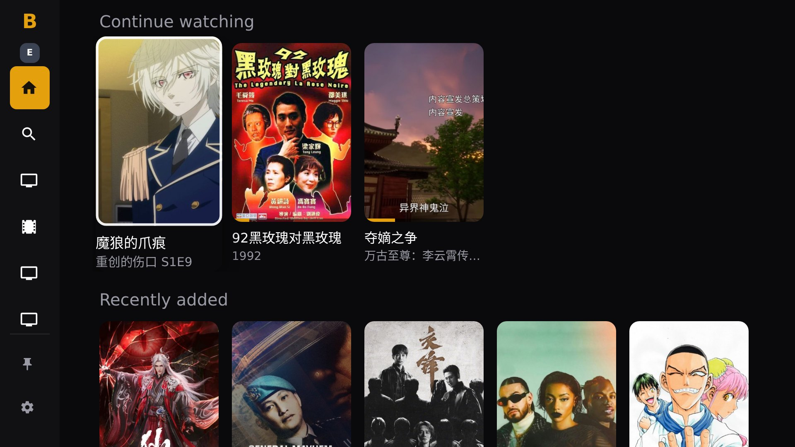
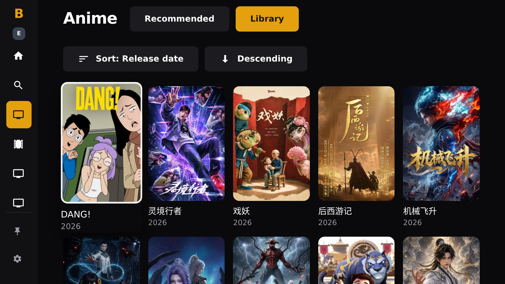
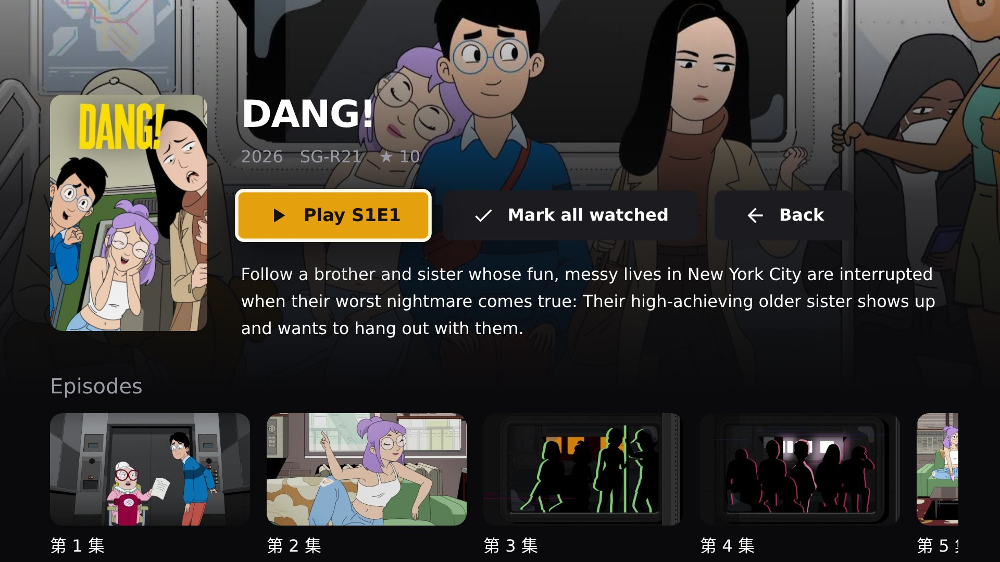
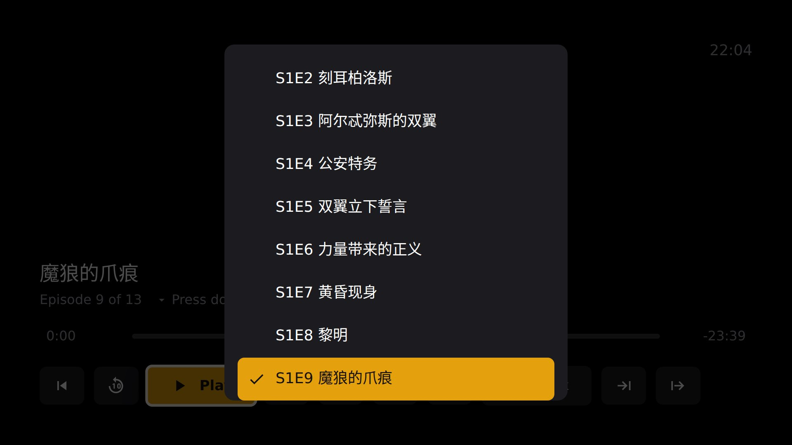
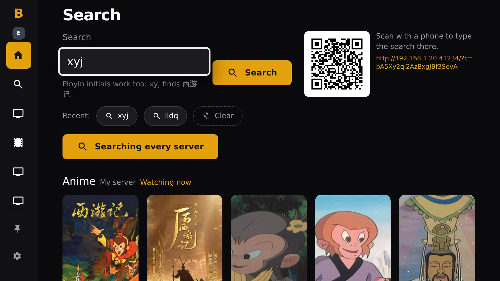
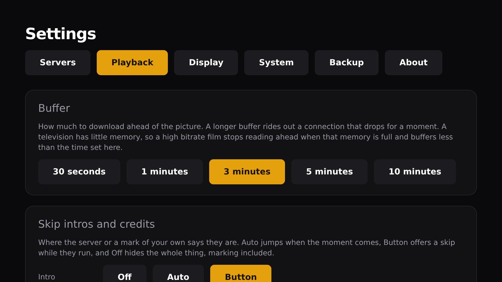

[简体中文](README.md) | English

An Emby client for Android TV, built for a remote control rather than a touchscreen.

**Latest version 0.6.2**, released 2026-09-21. Requires Android 7.0 or newer
(API 24).

## Screenshots

On a television, at 1080p.

<table>
<tr>
<td></td>
<td></td>
</tr>
<tr>
<td></td>
<td></td>
</tr>
<tr>
<td></td>
<td></td>
</tr>
</table>

## Download

| Download | Best for | Size |
| --- | --- | --- |
| [universal](https://github.com/liveinaus/bemplayer/releases/download/v0.6.2/bemplayer-0.6.2-universal.apk) | Works on every Android TV device | 19.3 MB |

There is one APK, and it works on every device.

## Install

Android TV will not install an app from a file until you allow it. The prompt appears the
first time and points at the right settings screen.

**With a file manager or sideload app** such as Downloader or Send Files to TV: copy the
APK across, open it, and accept the install prompt.

**With adb**, from a computer on the same network:

```bash
adb connect <tv-ip>:5555
adb install -r bemplayer-0.6.2-universal.apk
```

Then open Bemplayer from the Android TV home screen and enter your Emby server address,
for example `http://192.168.1.10:8096`.

## Updates

Bemplayer checks for new versions on its own and can install them without a computer.
Settings, then Updates, then Check now. Auto check is on by default and can be turned off
on the same screen.

The first update asks you to allow Bemplayer to install apps. That permission is what lets
it replace itself, and the app takes you straight to the setting.

## Using the remote

| Key                | In the player                                                              |
| ------------------ | -------------------------------------------------------------------------- |
| Centre, play/pause | Play or pause                                                              |
| Left, right        | Seek. Hold to go faster: 10s, 30s, 1m, 5m                                  |
| Up                 | Up a row of buttons; from the top row, hide the controls                   |
| Down               | Down a row of buttons; again for the episode strip; hold for the list      |
| Back               | Close the menu or QR code, then the episode strip, then ask before leaving |

Anywhere else, Back goes back one screen and never closes the app. Hold Back to be asked
whether to quit, which is the only way out.

The green button opens diagnostics from any screen, which is the quickest way to get
information for a bug report.

## What is in this release

### 新增 / Added

- 播放器：短按下键到按钮最下一行之外，会在控制栏下方展开本剧全部剧集的缩略图条（和剧集页一样），落在正在播放的一集上，左右浏览、中键切换；上键或返回收起。长按下键的选集列表保持不变。 / Player: a tap of Down off the bottom row of buttons opens a strip of the series' episode stills under the controls, as the series screen shows them, on the one playing; Left and Right browse it, OK switches, Up or Back puts it away. The list a held Down opens is unchanged.
- 播放器：右上角时间旁显示实时下载速度，即此刻真正从服务器收到的数据速率；不足 1 Mbps 时以 kbps 显示，没有数据到达时显示 0 kbps。电视上此前一直不显示，已修复。 / Player: the live download speed sits beside the clock in the top corner, the bytes actually arriving from the server at that moment; under a megabit it is written in kbps, and nothing arriving reads 0 kbps. On a TV it never showed before; fixed.

### 变更 / Changed

- 播放器：按返回不再直接退出播放，而是先询问「停止播放？」，中键确认离开，再按返回则继续看；控制栏上的返回按钮同样询问。播放尚未开始或已出错时直接离开。 / Player: Back no longer leaves the video outright; it asks "Stop watching?", OK leaves and Back again stays, and the bar's Back button asks too. A stream that never started or has failed is left without asking.

### 修复 / Fixed

- 播放器：从手机导入弹幕的二维码弹出后无法关闭，按返回会直接退出播放；现在按返回（或点击）关闭二维码，弹窗上也写明了。 / Player: the QR code for importing danmaku from a phone could not be dismissed, and Back left the video instead; Back (or a click) now closes it, and the card says so.
- 播放器：长按下键打开选集后，按住期间的连按不再让高亮从正在播放的一集往下走。 / Player: the repeats of the held Down that opens the episodes no longer walk the highlight down off the one playing.
- 播放器：控制栏显示期间按任意键都会重新计时，不会在浏览按钮或剧集条时中途消失。 / Player: any press while the bar is up keeps it up a while longer, so it no longer fades mid-way through walking the buttons or the episode strip.

What changed in every earlier version is in the [changelog](CHANGELOG.md).

## Verifying a download

```
c70c024c60f4414b85cb078c1bd65e7de95d6be4a48748c8af15e4ea8d01947a  bemplayer-0.6.2-universal.apk
```

Check one with `sha256sum bemplayer-0.6.2-universal.apk`.

## Reporting a problem

Open an issue at https://github.com/liveinaus/bemplayer/issues. The most useful thing you can attach
is a log export: press the green button on the remote, then Export, and the screen tells
you where the files landed.

Please include your device model, the Android version and the Emby server version.

## About this repository

This repository publishes builds only. It holds the releases, this page and
`update.json`, which is the file the app polls to discover new versions. The source is
kept in a separate private repository, and each release records the commit it was built
from: `2aa342c`.

Version 0.6.2 is build 602.
