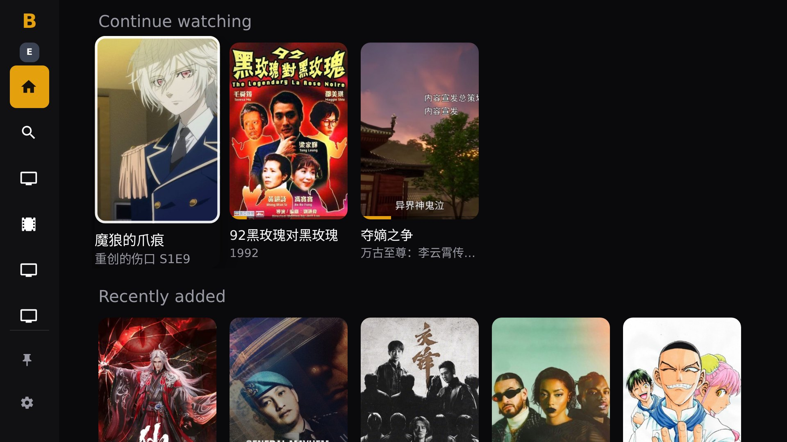
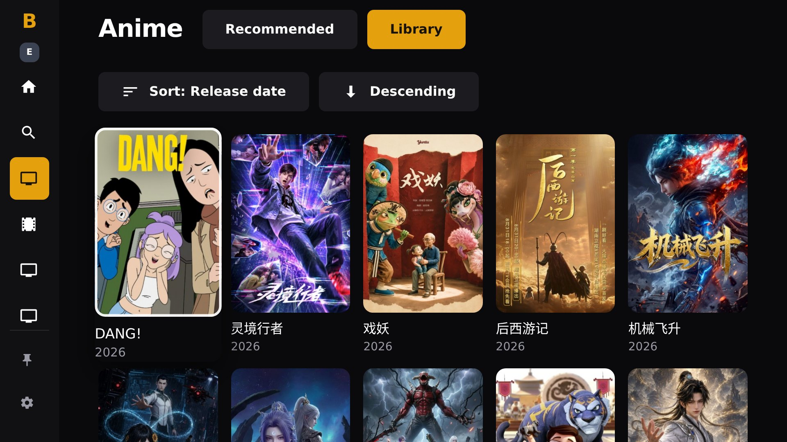
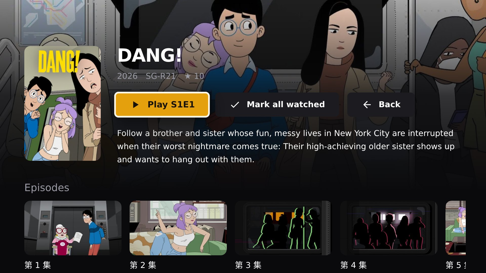
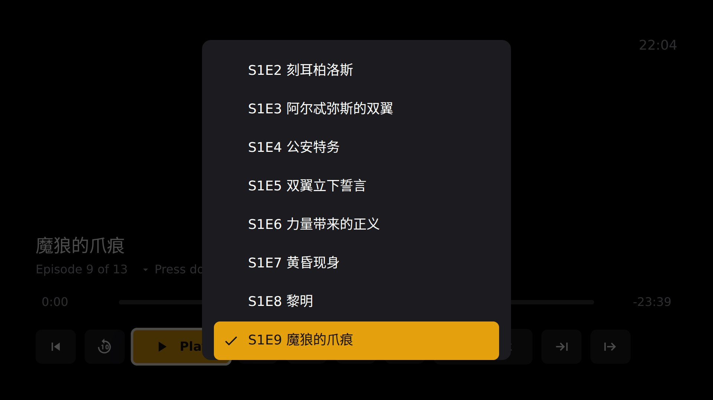
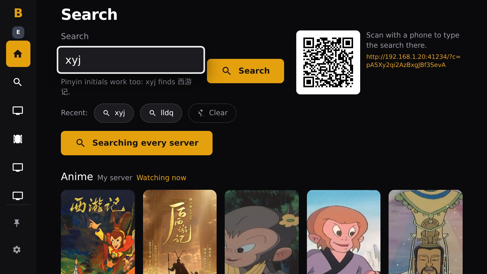
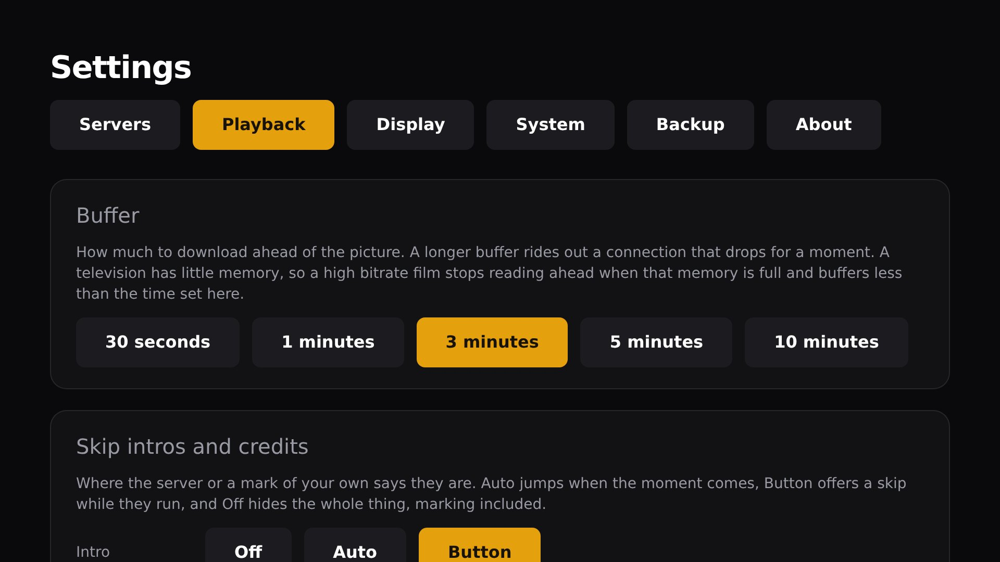

[简体中文](README.md) | English

An Emby client for Android TV, built for a remote control rather than a touchscreen.

**Latest version 0.6.15**, released 2026-09-27. Requires Android 7.0 or newer
(API 24).

## Screenshots

On a television, at 1080p.

<table>
<tr>
<td></td>
<td></td>
</tr>
<tr>
<td></td>
<td></td>
</tr>
<tr>
<td></td>
<td></td>
</tr>
</table>

## Download

| Download | Best for | Size |
| --- | --- | --- |
| [universal](https://github.com/liveinaus/bemplayer/releases/download/v0.6.15/bemplayer-0.6.15-universal.apk) | Works on every Android TV device | 19.4 MB |

`universal` is the one to take: it works on every device. If Bemplayer opens with a screen
saying the TV's WebView is too old, that screen says what can be done, and on a TV with
Google's WebView it can download and install a newer one itself. A newer WebView is a
system component shared by every app on the TV, and Settings → Apps → Android System
WebView → Uninstall updates puts the old one back.

## Install

Android TV will not install an app from a file until you allow it. The prompt appears the
first time and points at the right settings screen.

**With a file manager or sideload app** such as Downloader or Send Files to TV: copy the
APK across, open it, and accept the install prompt.

**With adb**, from a computer on the same network:

```bash
adb connect <tv-ip>:5555
adb install -r bemplayer-0.6.15-universal.apk
```

Then open Bemplayer from the Android TV home screen and enter your Emby server address,
for example `http://192.168.1.10:8096`.

## Updates

Bemplayer checks for new versions on its own and can install them without a computer.
Settings, then Updates, then Check now. Auto check is on by default and can be turned off
on the same screen.

The first update asks you to allow Bemplayer to install apps. That permission is what lets
it replace itself, and the app takes you straight to the setting.

## Using the remote

| Key                | In the player                                                              |
| ------------------ | -------------------------------------------------------------------------- |
| Centre, play/pause | Play or pause                                                              |
| Left, right        | Seek. Hold to go faster: 10s, 30s, 1m, 5m                                  |
| Up                 | Up a row of buttons; from the top row, hide the controls                   |
| Down               | Down a row of buttons; again for the episode strip; hold for the list      |
| Back               | Close the menu or QR code, then the episode strip, then ask before leaving |

Anywhere else, Back goes back one screen and never closes the app on its own. At the
screen with nothing behind it, Back asks whether to quit Bemplayer; holding Back leaves
at once, without asking.

The green button opens the logs from any screen (Settings › System › Logs on a remote
without one), which is the quickest way to get
information for a bug report.

## What is in this release

### 新增 / Added

- 服务器可以有多条线路。手机登录页多了一个"其他线路"框，服务器公布的备用地址每行填一个；设置 › 服务器 › 线路可以用手机增删、调整顺序，也可以在电视上直接选一条。正在用的线路完全没有响应（连不上或超时）时，会按顺序问下一条线路是不是同一台服务器，是就换过去并一直用它，图片和播放也跟着换。服务器返回错误状态不会触发换线；所有线路都没响应后，一分钟内不再重试。 / A server can have several addresses. The phone sign-in page has an "Other addresses" box for the backups a server announces, one per line, and Settings › Servers › Addresses changes them from a phone, reorders them, or picks one on the TV. When the address in use gets no answer at all (refused or timed out), the next is asked whether it is the same server, and if so it takes over and stays in use, images and playback with it. A server answering with an error status never causes a switch, and once no address answers none is tried again for a minute.
- 切换服务器列表里每个服务器都显示它有多少部电影和剧集。打开列表时向每个服务器问一次，用的是服务器自己记着的总数，不会遍历媒体库；一小时内再打开不会重复问。连不上的服务器不显示数字。 / The server switcher shows how many films and series each server has. Each server is asked once as the list opens, for the totals it already keeps, so no library is read through; opening it again within the hour asks nothing. A server that does not answer shows no figures.

### 变更 / Changed

- 服务器多于六个时，切换服务器列表改为三列的卡片：名称和状态点在上，电影和剧集数量在下，不显示地址，这样十一个服务器在电视上一屏放得下，不用滚动。六个及以下时数量显示在名称右边，地址照旧。 / With more than six servers the switcher is three columns of tiles — the name and its dot, with the film and series counts beneath and no address — so eleven servers fit on a TV screen without scrolling. With six or fewer the counts sit at the right of the name and the address stays.

### 修复 / Fixed

- 遥控器绿色按钮其实从来没有接上，按了什么都不会发生。现在在任意界面（包括播放中）按它都会打开运行日志；遥控器没有绿色按钮时，设置 › 系统 › 运行日志 是同一个界面。 / The green remote button was never actually wired up and did nothing. It now opens the logs from any screen, playback included; on a remote without one, Settings › System › Logs is the same screen.
- 有的电视把 E-AC3（杜比数字+）解成 5.1 声道后拒绝打开音频输出，报 ERROR_CODE_AUDIO_TRACK_INIT_FAILED，画面有、声音没有。现在遇到这种情况会自动重试：先关掉隧道播放，还不行就把声音缩混成立体声；本次运行里之后的影片直接沿用。 / Some televisions decode E-AC3 (Dolby Digital Plus) to 5.1 and then refuse to open an audio output for it, reporting ERROR_CODE_AUDIO_TRACK_INIT_FAILED and leaving the film silent. Playback now retries by itself, first without tunnelling and then downmixed to stereo, and later films in the same session start that way.

What changed in every earlier version is in the [changelog](CHANGELOG.md).

## Verifying a download

```
89ecaf1f74d26da7efdd422d7412d6a9e1fbf9f54965fd06c4ec7779d64e8928  bemplayer-0.6.15-universal.apk
```

Check one with `sha256sum bemplayer-0.6.15-universal.apk`.

## Reporting a problem

Open an issue at https://github.com/liveinaus/bemplayer/issues. The most useful thing you can attach
is a log export: press the green button on the remote (or open Settings › System ›
Logs), then Export, and the screen tells
you where the files landed.

Please include your device model, the Android version and the Emby server version.

For bug reports, suggestions or a chat, there is also the Telegram group
[@bemplayer](https://t.me/bemplayer). Its QR code is under Settings → About in the app.

## About this repository

This repository publishes builds only. It holds the releases, this page and
`update.json`, which is the file the app polls to discover new versions. The source is
kept in a separate private repository, and each release records the commit it was built
from: `9f99809`.

Version 0.6.15 is build 615.
