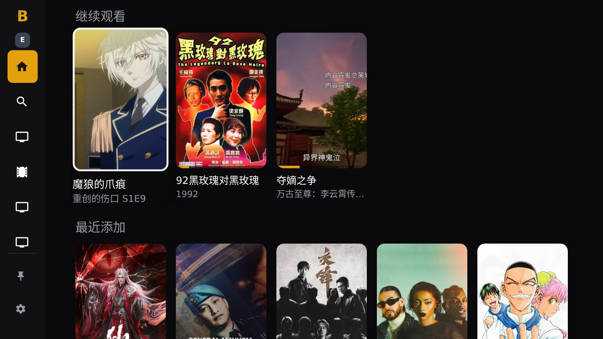
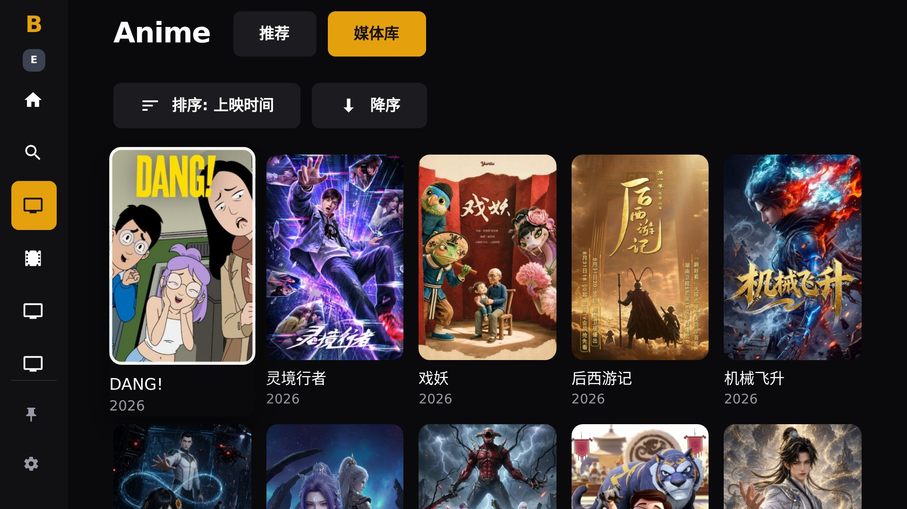
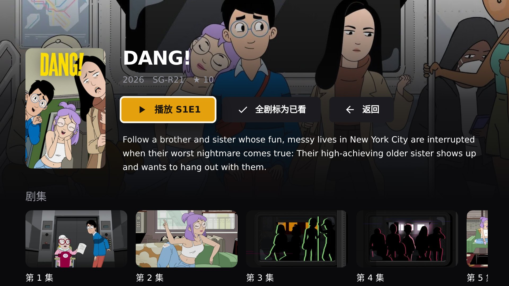
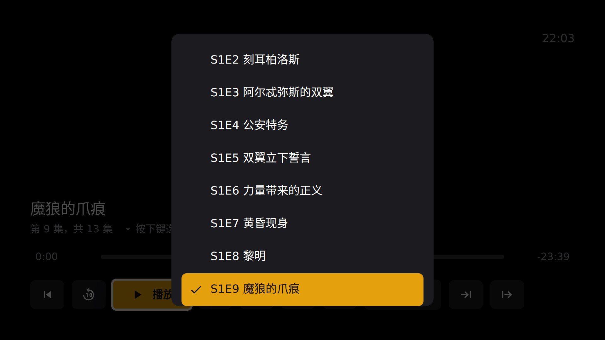
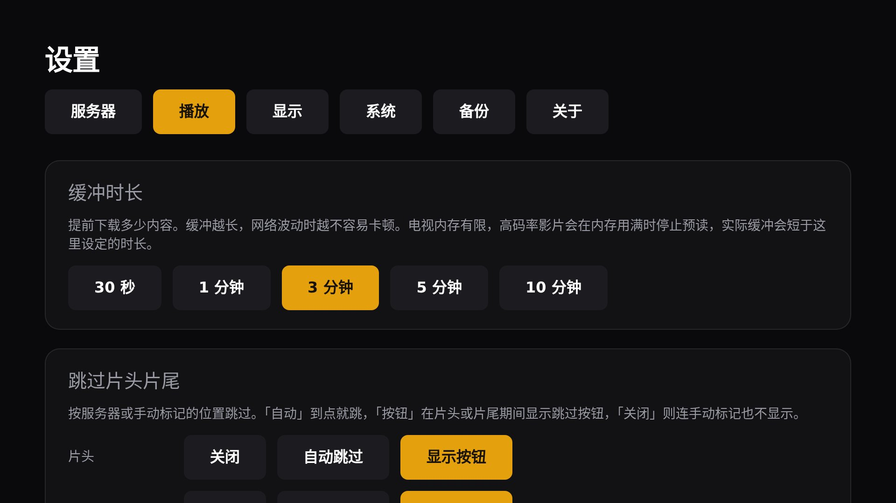

简体中文 | [English](README.en.md)

一款为 Android TV 打造的 Emby 客户端，为遥控器而设计，而不是触摸屏。

**最新版本 0.5.0**，发布于 2026-09-19。需要 Android 7.0
或更高版本（API 24）。

## 截图

在电视上的样子（1080p）。

<table>
<tr>
<td></td>
<td></td>
</tr>
<tr>
<td></td>
<td></td>
</tr>
<tr>
<td></td>
<td></td>
</tr>
</table>

## 下载

| 下载 | 适合 | 大小 |
| --- | --- | --- |
| [universal](https://github.com/liveinaus/bemplayer/releases/download/v0.5.0/bemplayer-0.5.0-universal.apk) | 适用于所有 Android TV 设备 | 16.2 MB |

只有一个安装包，所有设备都用它。

## 安装

Android TV 默认不允许安装来自文件的应用。第一次安装时会弹出提示，并直接指向对应的设置页面。

**用文件管理器或投送工具**，例如 Downloader 或 Send Files to TV：把 APK 传到电视上，打开
它，同意安装提示。

**用 adb**，在同一网络的电脑上执行：

```bash
adb connect <电视的IP>:5555
adb install -r bemplayer-0.5.0-universal.apk
```

然后在 Android TV 主界面打开 Bemplayer，填入你的 Emby 服务器地址，例如
`http://192.168.1.10:8096`。

## 更新

Bemplayer 会自行检查新版本，不用电脑也能安装。进入设置，再进更新，然后点立即检查。自动检查
默认开启，也可以在同一个页面关掉。

第一次更新会请求允许 Bemplayer 安装应用。正是这个权限让它可以替换自己，应用会直接带你到那个
设置项。

## 遥控器按键

| 按键              | 在播放器中                                     |
| ----------------- | ---------------------------------------------- |
| 确定键、播放/暂停 | 播放或暂停                                     |
| 左、右            | 快退快进。按住会加速：10 秒、30 秒、1 分、5 分 |
| 上                | 播放诊断信息                                   |
| 下                | 音轨与字幕                                     |
| 返回              | 先关菜单，再收起控制栏，最后离开播放器         |

在其他界面，返回键是返回上一层，永远不会直接关掉应用。长按返回键才会询问是否退出，这是离开应
用的唯一方式。

绿色按键在任何界面都能打开诊断信息，这是拿到反馈问题所需资料最快的办法。

## 这个版本有什么

### 新增 / Added

- 多季的剧集可以按季筛选，默认显示最新一季，选过的季会被记住。 / A series with several seasons can be filtered by season; it opens on the latest, and a chosen season is remembered.
- 单集页面上的剧名和季名可以点击，分别打开该剧和该季。 / On an episode, the series name and the season are links: one opens the series, the other opens it on that season.
- 可以把单集、整季或整部剧标为已看（或未看），已看的内容不再被推荐；卡片上会显示已看标记。 / An episode, a season or a whole series can be marked watched (or unwatched), so it stops being recommended; cards show a watched tick.
- 媒体库页面分为「推荐」和「媒体库」两个标签，推荐页按本库展示继续观看、接下来、最近添加、最新上映、高分作品和为你推荐。 / A library opens on two tabs, Recommended and Library; Recommended shows continue watching, next up, recently added, recently released, top rated and suggestions for that library alone.
- 侧边栏可以整理：每个媒体库左侧有 ⋮ 按钮，可移动顺序或从侧边栏移除，顺序会被记住。 / The sidebar can be arranged: each library has a ⋮ handle to move it up or down or unpin it, and the order is kept.
- 设置页新增「关于」，含项目说明、版本号、GitHub 链接和二维码。 / Settings has an About section with a description, the version, the GitHub link and a QR code for it.
- 点击侧边栏顶部的 Bemplayer 标志可直接打开设置。 / The Bemplayer logo at the top of the sidebar opens Settings.
- 检查更新发现新版本时会弹出对话框，确定安装、取消忽略。 / Finding an update opens a dialog: OK installs, Cancel dismisses.
- 系统 WebView 过旧（低于 Chrome 99）时，启动页会说明原因和解决办法，而不是停在白屏。 / A TV whose WebView is older than Chrome 99 sees an explanation and what to do about it instead of a blank white screen.

### 变更 / Changed

- 侧边栏默认收起为图标栏，遥控器移入或鼠标悬停时展开，不再挤占内容区。 / The sidebar is a rail of icons that opens when the D-pad moves into it or the mouse hovers, leaving the screen to the content.
- 剧集以横向的画面缩略图卡片展示，带观看进度，而不是纯文字列表。 / Episodes are shown as a horizontal shelf of stills with progress, not a list of titles.
- 媒体库和搜索结果按行均匀铺满屏幕宽度。 / Library and search grids share each row out evenly across the screen.
- 切换视频时先显示黑屏和「正在加载…」，不再残留上一个视频的画面。 / Switching videos shows a black screen and "Loading…" until the new one has a picture, instead of the last frame of the previous one.
- 搜索范围的控件分成两行：一个开关，下面是各服务器的包含状态。 / The search scope controls are split into the switch and, under it, which servers are included.
- 焦点白框改为画在元素内部，电视上不再缺边。 / The focus ring is drawn inside the element, so it no longer loses its sides on a TV.
- 只发布 universal 版 APK，不再区分 CPU 架构。 / Only the universal APK is published, no more per-architecture builds.
- 播放器：快进快退连按或按住会累加，屏幕中央显示总变化量（如 +3:30）和落点，停止按键后才真正跳转；按住会逐级加速。 / Player: forward and back presses add up, the sum (+3:30) and where it lands are shown in the middle of the screen, and the seek happens once the presses stop; a held button climbs through larger steps.
- 播放器：控制栏右上角显示当前时间；按「上」可收起控制栏。 / Player: the bar shows the time of day in its corner, and Up takes the bar away.
- 播放器：下载速度改为实时传输速率，不再是估算值。 / Player: the download rate is what is arriving now, not an estimate of the line.

### 修复 / Fixed

- 快退和快进按钮的图标方向反了。 / The rewind and forward icons curled the wrong way.
- 打开一部剧时焦点落在「返回」上，现在落在「播放」或「继续」上。 / Opening a series landed focus on Back; it now lands on Play or Resume.
- 搜索页的侧边栏有时不显示媒体库。 / The sidebar on the search screen sometimes showed no libraries.
- 每次启动时的白色闪屏。 / The white flash on every launch.
- 发布说明取错了来源，显示成上一个版本的提交信息。 / Release notes were taken from the wrong place and showed the previous version's commit message.

以前每个版本改了什么，见 [更新日志](CHANGELOG.md)。

## 校验下载的文件

```
98e359bc5411dd796e100a0b963c46719f4551f114c94284ee3a9bb84fd478fe  bemplayer-0.5.0-universal.apk
```

用 `sha256sum bemplayer-0.5.0-universal.apk` 校验其中一个。

## 反馈问题

到 https://github.com/liveinaus/bemplayer/issues 提交 issue。最有用的附件是日志导出：按遥控器上的绿色
按键，然后选导出，屏幕上会告诉你文件放在哪里。

请一并附上设备型号、Android 版本和 Emby 服务器版本。

## 关于这个仓库

这个仓库只发布构建产物。它存放各个发行版、这个页面，以及 `update.json`，也就是应用用来发现新
版本的那个文件。源代码放在另一个私有仓库里，每次发布都会记录它构建自哪个提交：
`5de1e64`。

版本 0.5.0 是第 500 号构建。
