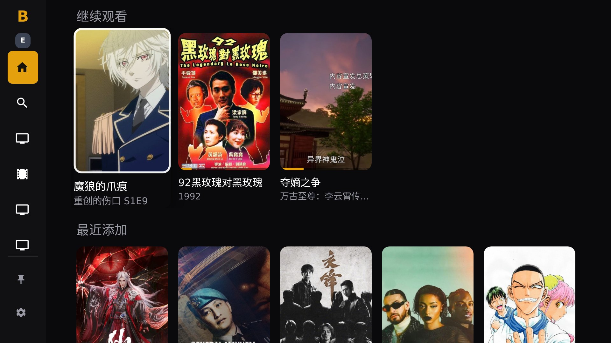
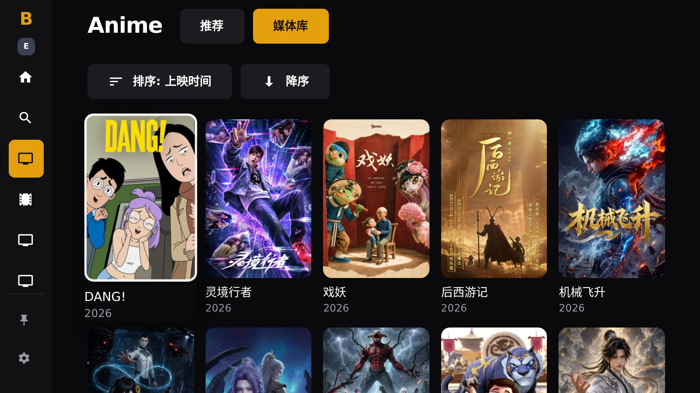
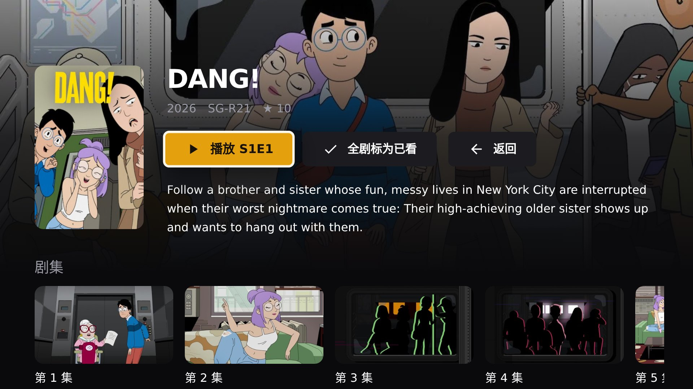
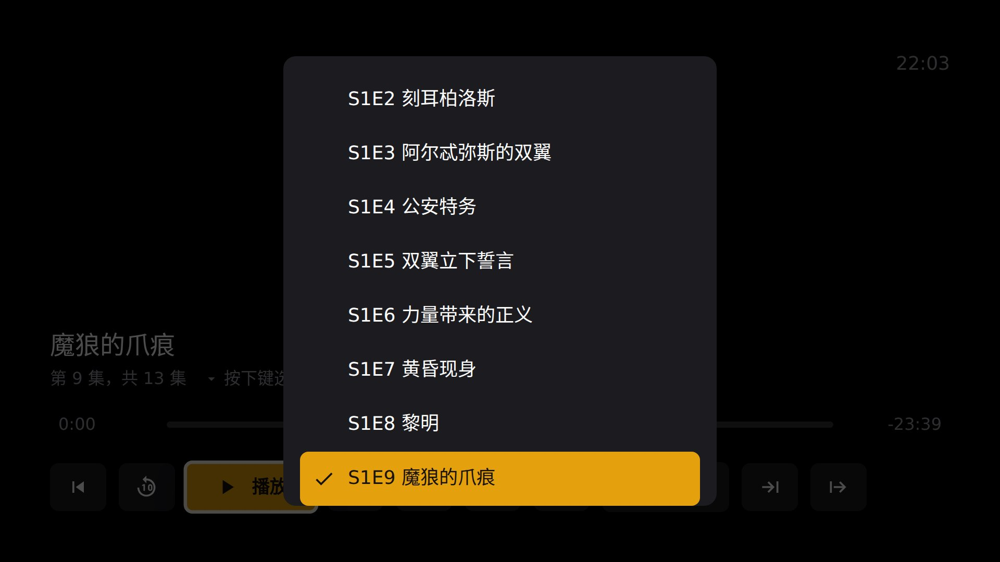
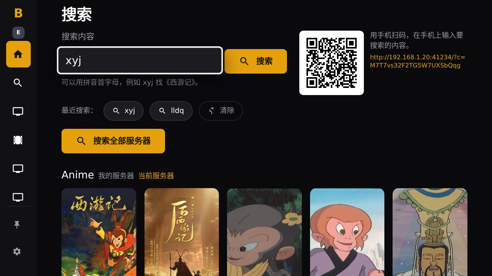
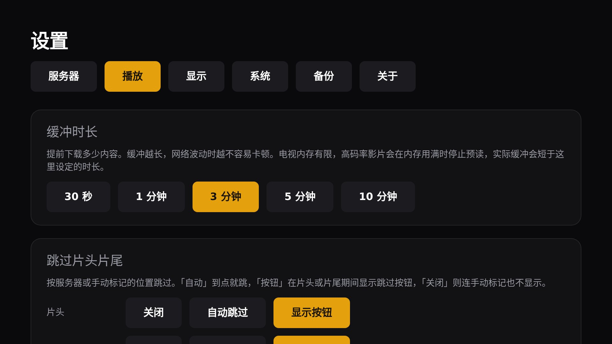

简体中文 | [English](README.en.md)

一款为 Android TV 打造的 Emby 客户端，为遥控器而设计，而不是触摸屏。

**最新版本 0.6.20**，发布于 2026-10-03。需要 Android 7.0
或更高版本（API 24）。

## 截图

在电视上的样子（1080p）。

<table>
<tr>
<td></td>
<td></td>
</tr>
<tr>
<td></td>
<td></td>
</tr>
<tr>
<td></td>
<td></td>
</tr>
</table>

## 下载

| 下载 | 适合 | 大小 |
| --- | --- | --- |
| [universal](https://github.com/liveinaus/bemplayer/releases/download/v0.6.20/bemplayer-0.6.20-universal.apk) | 适用于所有 Android TV 设备 | 25.1 MB |

下载 `universal` 即可，所有设备都能用。如果打开 Bemplayer 后显示「此电视的 WebView 太旧」，那个界面会说明
可以怎么做；使用 Google WebView 的电视可以在界面上直接下载并安装新版。新的 WebView 是电视上所有应用共用的
系统组件，如需恢复：设置 → 应用 → Android System WebView → 卸载更新。

## 安装

Android TV 默认不允许安装来自文件的应用。第一次安装时会弹出提示，并直接指向对应的设置页面。

**用文件管理器或投送工具**，例如 Downloader 或 Send Files to TV：把 APK 传到电视上，打开
它，同意安装提示。

**用 adb**，在同一网络的电脑上执行：

```bash
adb connect <电视的IP>:5555
adb install -r bemplayer-0.6.20-universal.apk
```

然后在 Android TV 主界面打开 Bemplayer，填入你的 Emby 服务器地址，例如
`http://192.168.1.10:8096`。

## 更新

Bemplayer 会自行检查新版本，不用电脑也能安装。进入设置，再进更新，然后点立即检查。自动检查
默认开启，也可以在同一个页面关掉。

第一次更新会请求允许 Bemplayer 安装应用。正是这个权限让它可以替换自己，应用会直接带你到那个
设置项。

## 遥控器按键

| 按键              | 在播放器中                                             |
| ----------------- | ------------------------------------------------------ |
| 确定键、播放/暂停 | 播放或暂停                                             |
| 左、右            | 快退快进。按住会加速：10 秒、30 秒、1 分、5 分         |
| 上                | 回到上一行按钮；在最上一行时收起控制栏                 |
| 下                | 到达下一行按钮；再按展开剧集缩略图条；长按打开选集列表 |
| 返回              | 先关菜单或二维码，再收起剧集条，最后询问是否停止播放   |

在其他界面，返回键是返回上一层，不会自己关掉应用。回到没有上一层可回的那一屏时，按返回会询问
是否退出 Bemplayer；长按返回则直接退出，不再询问。

绿色按键在任何界面都能打开运行日志（遥控器没有绿色按键时，在 设置 › 系统 › 运行日志 打开），这是拿到反馈问题所需资料最快的办法。

## 这个版本有什么

### 修复 / Fixed

- 搜索结果不再列出单集：搜「兰香如故」只出这部剧，不再跟着一屏它的剧集。 / Search no longer lists single episodes: searching 兰香如故 finds the show, not the show followed by a screen of its episodes.

以前每个版本改了什么，见 [更新日志](CHANGELOG.md)。

## 校验下载的文件

```
8874d6856b880115cd506544ab41f64304b04a3f10605df3bbd2e55af287fe6c  bemplayer-0.6.20-universal.apk
```

用 `sha256sum bemplayer-0.6.20-universal.apk` 校验其中一个。

## 反馈问题

到 https://github.com/liveinaus/bemplayer/issues 提交 issue。最有用的附件是日志导出：按遥控器上的绿色
按键（或 设置 › 系统 › 运行日志），然后选导出，屏幕上会告诉你文件放在哪里。

请一并附上设备型号、Android 版本和 Emby 服务器版本。

问题反馈、功能建议或随便聊聊，也可以加入 Telegram 群组 [@bemplayer](https://t.me/bemplayer)。
应用里 设置 → 关于 有它的二维码。

## 关于这个仓库

这个仓库只发布构建产物。它存放各个发行版、这个页面，以及 `update.json`，也就是应用用来发现新
版本的那个文件。源代码放在另一个私有仓库里，每次发布都会记录它构建自哪个提交：
`26af068`。

版本 0.6.20 是第 620 号构建。
